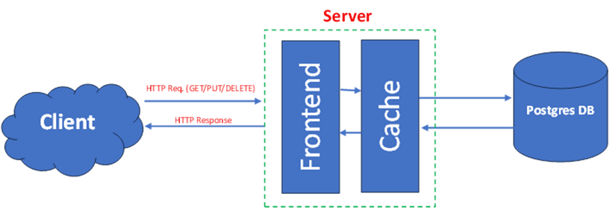

# High-Performance HTTP Key-Value Server (CS744 Project) [Link to repo](https://github.com/silent-learner/Key-Value-Store--DECS-Project-)

This project is a C++ implementation of a multi-tier, HTTP-based Key-Value server. It is built for a performance engineering course to find and analyze different system bottlenecks, based on the requirements from the "CS744 Project: HTTP-based KV Server" document.

The system consists of three main C++ executables:

* **kv\_server**: The multi-threaded, two-tier server with an in-memory cache and a database connection pool.
* **kv\_client**: A simple, interactive command-line client for manual testing and cache warming.
* **load\_generator**: A multi-threaded, closed-loop load generator used to stress-test the server and find bottlenecks.

## Architecture

1.  **HTTP Frontend**: A multi-threaded HTTP server using cpp-httplib  accepts RESTful API requests.
2.  **In-Memory Cache**: A custom, thread-safe LRU (Least Recently Used) cache (`LRUCache`) handles the `get_popular` (cache-hit) workload.
3.  **Database Backend**: A thread-safe connection pool (`ConnectionPool`) manages persistent connections to a PostgreSQL database to handle `put_all` (cache-miss/write) workloads.


## 1. Installation & Prerequisites

This guide assumes a Debian-based Linux environment (like Ubuntu).

### 1.1: Install System Tools & Libraries

You'll need a C++ compiler, make, git, and the development libraries for PostgreSQL (libpqxx and libpq).

```sh
sudo apt-get update
sudo apt-get install -y build-essential g++ make git
sudo apt-get install -y libpq-dev libpqxx-dev pkg-config
```
(**Note**: pkg-config is required by the Makefile to find libpqxx flags.)

### 1.2: Install Docker
We use Docker to run the PostgreSQL database in an isolated container, as suggested in the project document.

```
sudo apt-get install -y docker.io
sudo usermod -aG docker $USER
newgrp docker
```

### 1.3: Install Monitoring Tools
You will need these to identify the bottlenecks.
```
# iostat is for monitoring I/O
sudo apt-get install -y sysstat
# htop is a better version of top for monitoring CPU
sudo apt-get install -y htop
```

## 2. Setup & Configuration

### 2.1: Set Up the PostgreSQL Database

1.  **Start the Container**: This command downloads PostgreSQL and runs it in a container named `kv-postgres` on port 5432.
    ```sh
    docker run --name kv-postgres -e POSTGRES_PASSWORD=mysecretpassword -p 5432:5432 -d postgres
    ```
2.  **Connect to the Container**: This gets you a `psql` shell inside the running container.
    ```sh
    docker exec -it kv-postgres psql -U postgres
    ```
3.  **Create the Database**: Inside the `psql` shell (which looks like `postgres=#`), create the database named `kv_store`.
    ```sql
    CREATE DATABASE kv_store;
    ```
4.  **Connect to the New Database**: This is a critical step. You must switch your connection to the new database.
    ```sql
    \c kv_store
    ```
    Your prompt will change to `kv_store=#`.
5.  **Create the Table**: Now, create the `key_value` table that the C++ server expects.
    ```sql
    CREATE TABLE key_value (
      key_text TEXT PRIMARY KEY,
      value_text TEXT
    );
    ```
6.  **Verify and Exit**: Type `\dt` to see your new table. Type `\q` to exit `psql` and return to your terminal.

### 2.2: Get Project Code & Dependencies

1.  **Clone**: Clone this repository.
    ```sh
    git clone [https://github.com/silent-learner/Key-Value-Store--DECS-Project-.git](https://github.com/silent-learner/Key-Value-Store--DECS-Project-.git)
    ```
    Your directory should now look like this:
    ```
    build/
        ├── Makefile
        ├── server.cpp
        ├── client.cpp
        ├── load_generator.cpp
        └── cpp-httplib/
    README.md
    ```
## 3. Compilation

We will use the provided Makefile.

1.  **Run make**: From your project's build directory, just run:
    ```sh
    make
    ```
    This will compile all three executables: `kv_server`, `kv_client`, and `load_generator`.

## 4. How to Run & Test

You will need at least two machines: a **Server Machine** and a **Client Machine**.

### 4.1: On the Server Machine

1.  **Start the Server**: Navigate to your project directory and run the server executable. 
    ```sh
    ./kv_server
    ```
    You should see: `Database connection pool created... Server listening...` 
2.  **(Optional Experiment) CPU Pinning**: To run the server only on CPU Core 1 (as mentioned in the project spec via `taskset`), you can launch it like this: 
    ```sh
    taskset -c 1 ./kv_server
    ```

### 4.2: On the Client Machine

1.  **Start the client**: Navigate to your project directory and run client executable.
    ```sh
    ./kv_client <SERVER IP> <SERVER PORT>
    ```

### 4.3: Manual Test (Optional)

You can now run the `kv_client` on your client machine to test the connection.

```sh
./kv_client
> put mykey hello_from_another_machine
Status: 200
Body: OK
> get mykey
Status: 200
Body: hello_from_another_machine
> quit
```
